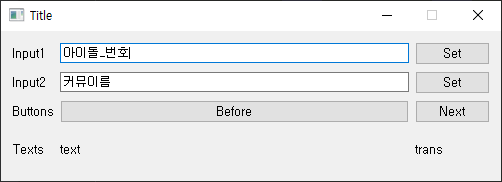

# ShinyColors Text Viewer   
TODO add Description

## Usage

Download .exe from [Google Drive](https://drive.google.com/file/d/1lND_-w6qF0oNIjiHKZsyK_rsKcHkYPco/view?usp=sharing)    

Input1에는 아이돌_번호 입력(1~23)  
Input2에는 커뮤 제목 입력(한패 시트 네이밍대로)
아래는 커뮤 제목 입력 예시  
Before/Next 버튼은 클릭시 전/후 대사로 이동함.

>P\SR-1\ショッピング日和  

## License
Code: MIT licensed  
Text: based on [Translation Project](https://docs.google.com/spreadsheets/d/12NpZ_Tq0OMAePUn-Wuu9lH0202L5f9nvJc1pEI5CM8M/edit?usp=sharing)  
  
TODO

## Executables

Tested build with pyinstaller  

TODO  

